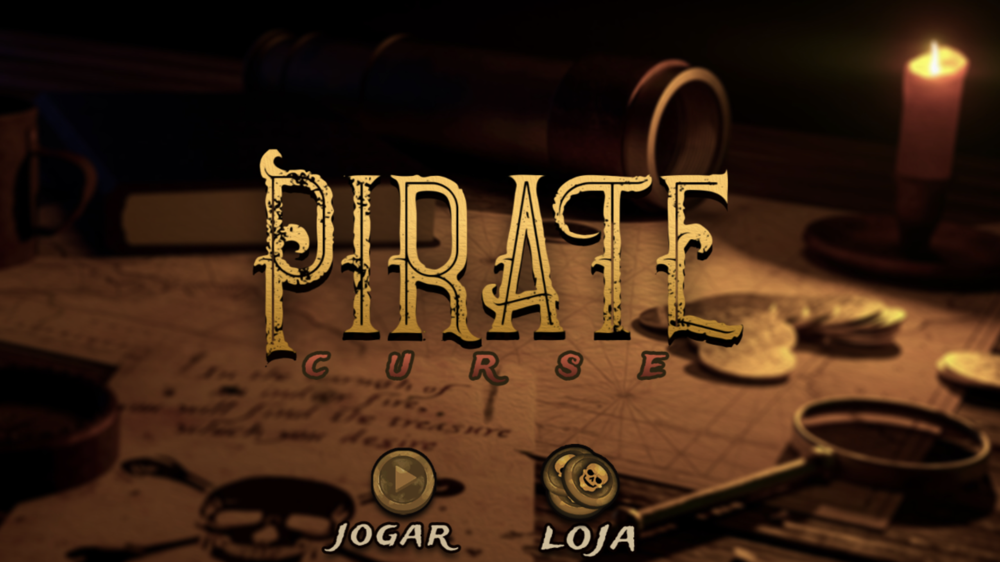

# Pirate Curse

 

Web game developed in the first semester of college (2018). Made by Rafael Pignataro, Vinicius Junqueira and Lucas Zillig.

- HTML, CSS, Javascript
- Phaser.js

## Run in your computer 🚀

### 1. Serve the index.html

Its just static files, use a web server like vscode live server to serve the **index.html**.

This starts your app in development mode, rebuilding assets on file changes.

### 2. Open in your browser

Access the server url in the browser. If you used Live Server probably the url is: **http://127.0.0.1:5500**.

### 3. Now click play and have some fun

